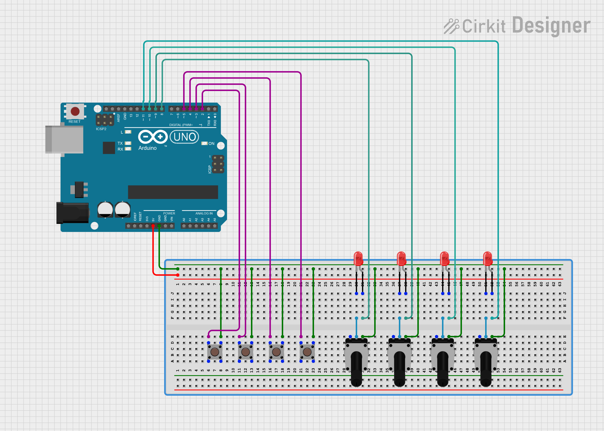

# Using Multiple Buttons to Control Multiple LEDs

In this project you will create a circuit with 4 buttons and 4 LEDs as shown in Connection diagram. When controlling lights, typically you are used to associating a switch with a given light or set of lights—if you change the position of a switch, the same lights always turn off or on.

Connection Diagram


Code placed in ```sketch_feb10a.ino```